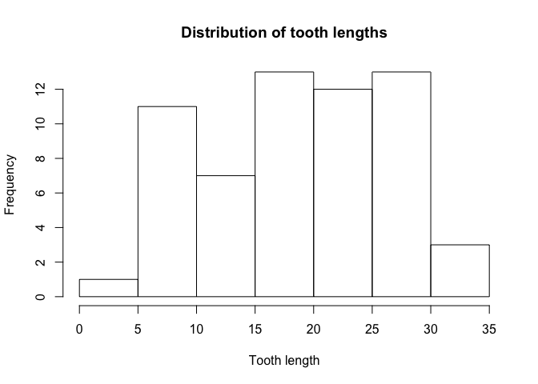
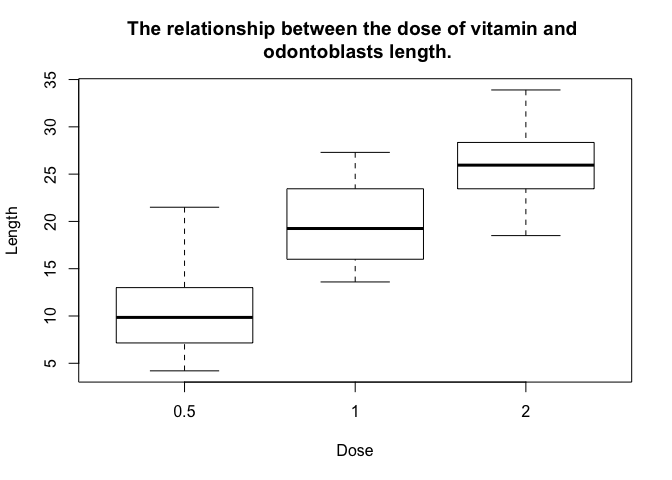
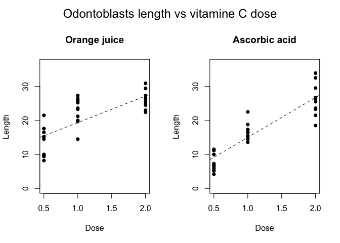

Statistical inference project
================
Denys Stadnyk

We are going to analyze ToothGrowth data and perform some Exploratory and Basic Inferential Data Analysis.

ToothGrowth data is a dataset from R datasets package. It gives information about the effect of vitamin C on tooth growth in Guinea pigs. Basic description of dataset: The response is the length of odontoblasts (cells responsible for tooth growth) in 60 guinea pigs. Each animal received one of three dose levels of vitamin C (0.5, 1, and 2 mg/day) by one of two delivery methods, (orange juice or ascorbic acid (a form of vitamin C and coded as VC).

Exploratory Data Analysis
=========================

Load data and get a summary:

``` r
library(data.table)
ToothGrowth <- data.table(ToothGrowth)
summary(ToothGrowth)
```

    ##       len        supp         dose      
    ##  Min.   : 4.20   OJ:30   Min.   :0.500  
    ##  1st Qu.:13.07   VC:30   1st Qu.:0.500  
    ##  Median :19.25           Median :1.000  
    ##  Mean   :18.81           Mean   :1.167  
    ##  3rd Qu.:25.27           3rd Qu.:2.000  
    ##  Max.   :33.90           Max.   :2.000

Length of odontoblasts varies from 4.2 to 33.9, dose from 0.5 to 2.0. There are only 2 delivery methods (as described above) that are coded with OJ (orange juice) and VC (ascorbic acid), each has 30 observations.

Distribution of tooth length is mostly uniform.

``` r
hist(ToothGrowth$len, xlab = "Tooth length", main = "Distribution of tooth lengths")
```



What about the relationship of the dose of vitamin C and the length of odontoblasts?

``` r
boxplot(ToothGrowth$len ~ ToothGrowth$dose, xlab = "Dose", ylab = "Length",
        main = "The relationship between the dose of vitamin and \n odontoblasts length.")
```



From the plot, we clearly see that there is such relationship. Let's see if we have a similar relationship with both delivery methods.

``` r
par(mfrow = c(1,2),oma = c(0, 0, 2, 0))
plot(ToothGrowth[supp == "OJ", list(dose, len)], pch = 16, ylim=c(0,36.5),
     main = "Orange juice", ylab = "Length", xlab = "Dose")
abline(lm(ToothGrowth[supp == "OJ", list(dose, len)]$len ~ 
            ToothGrowth[supp == "OJ", list(dose, len)]$dose), lty = 2)

plot(ToothGrowth[supp == "VC", list(dose, len)], pch = 16, ylim=c(0,36.5),
     main = "Ascorbic acid", ylab = "Length", xlab = "Dose")
abline(lm(ToothGrowth[supp == "VC", list(dose, len)]$len ~ 
            ToothGrowth[supp == "VC", list(dose, len)]$dose), lty = 2)
mtext("Odontoblasts length vs vitamine C dose",outer = TRUE, cex = 1.5)
```



Basic Inferential Data Analysis
===============================

From our plots we have seen that probably there is a relationship between the dose and tooth length, also we've seen that efficiency of vitamin C varies in different delivery methods.

Questions are:
--------------

1.  Is giving bigger dose makes tooth length bigger?
2.  Which delivery method provides a better result?

Hypothesis 1: Giving bigger dose makes tooth length bigger.
-----------------------------------------------------------

We'll use two sampled t.test.

``` r
t.test(ToothGrowth[dose == 1]$len, ToothGrowth[dose == 0.5]$len,
       alternative = "greater")$p.value
```

    ## [1] 6.341504e-08

With p-value 6.342e-08 we can say it is a statistically significant result that with dose 1 milligram/day tooth length is more than with 0.5 milligrams/day. The same test for 2 mg and 1 mg dose:

``` r
t.test(ToothGrowth[dose == 2]$len, ToothGrowth[dose == 1]$len,
       alternative = "greater")$p.value
```

    ## [1] 9.532148e-06

### Conclusion:

Our hypothesis is true: giving bigger dose makes tooth length bigger.

Hypothesis 2: Orange juice gives better results than ascorbic acid.
-------------------------------------------------------------------

From our previous plots, we can assume that for different doses orange juice and ascorbic acid give different results. So, we test our hypothesis for every dose (0.5, 1, 2).

### Dose 0.5 mg/day

``` r
t.test(ToothGrowth[dose == 0.5 & supp == "OJ"]$len,
       ToothGrowth[dose == 0.5 & supp == "VC"]$len, alternative = "greater")$p.value
```

    ## [1] 0.003179303

With p-value = 0.003179 we can conclude that for 0.5 mg/day dose Orange juice gives better results than ascorbic acid.

### Dose 1 mg/day

``` r
t.test(ToothGrowth[dose == 1 & supp == "OJ"]$len,
       ToothGrowth[dose == 1 & supp == "VC"]$len, alternative = "greater")$p.value
```

    ## [1] 0.0005191879

P-value 0.0005192 gives us a statistically significant result of the superiority of orange juice method over ascorbic acid.

### Dose 2 mg/day

Greater hypothesis:

``` r
t.test(ToothGrowth[dose == 2 & supp == "OJ"]$len,
       ToothGrowth[dose == 2 & supp == "VC"]$len, alternative = "greater")$p.value
```

    ## [1] 0.5180742

Not equal hypothesis:

``` r
t.test(ToothGrowth[dose == 2 & supp == "OJ"]$len,
       ToothGrowth[dose == 2 & supp == "VC"]$len)$p.value
```

    ## [1] 0.9638516

As for 2 mg/day dose, we can't say that means are different in the statistically significant way.

### Conclusion:

For 0.5 mg/day and 1 mg/day, our hypothesis is true: orange juice gives better results than ascorbic acid. For 2 mg/day, there is no statistically significant difference between methods of delivery vitamin C.

Conclusions and assumptions:
============================

Assumptions
-----------

1.  As we do not have a control group, which did not get vitamin C we assume that their tooth length is less than in our data (so there is a practical sense in our analysis).
2.  Each population with the same delivery method should follow normal distribution (so we can test it with t.test).

Conclusions
-----------

1.  Giving a bigger dose of vitamin C leads to more teeth growth.
2.  For the doses of 0.5 and 1 mg/day, it is more efficient to deliver vitamin C with orange juice, for the dose of 2 mg/day there is no statistically significant difference between methods of delivery.
